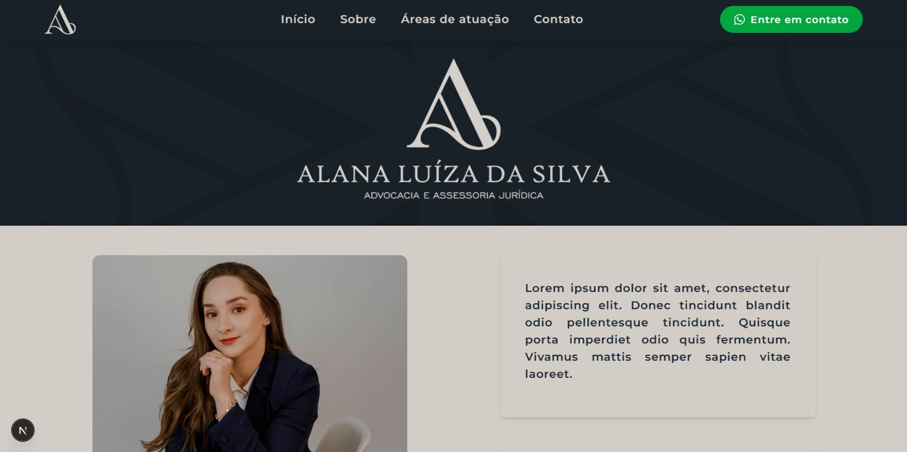

# ALS Advocacia – Website Institucional

Este é o site institucional da ALS Advocacia, desenvolvido com foco em reunir as principais informações para o cliente e facilitar o contato com o escritório.

---

## ✨ Tecnologias utilizadas

- [Next.js](https://nextjs.org/) – Framework React moderno
- [Tailwind CSS](https://tailwindcss.com/) – Estilização utilitária
- [TypeScript](https://www.typescriptlang.org/) – Tipagem estática
- [React Icons](https://react-icons.github.io/react-icons/) – Ícones leves
- Fontes personalizadas via `@font-face`

---

## 📌 Funcionalidades

- Página única com seções:
  - Hero (capa de destaque)
  - Sobre o escritório
  - Áreas de atuação
- Layout responsivo para mobile e desktop
- Scroll suave entre seções com navbar fixa
- Imagens otimizadas com carregamento ajustado
- Design elegante com cores institucionais

---

## 🔗 Acesse o site

👉 [https://alsadvocacia.adv.br](https://alsadvocacia.adv.br)

---

## ✍️ Desenvolvido por

[Manuela Antunes](https://github.com/manupicoli)
